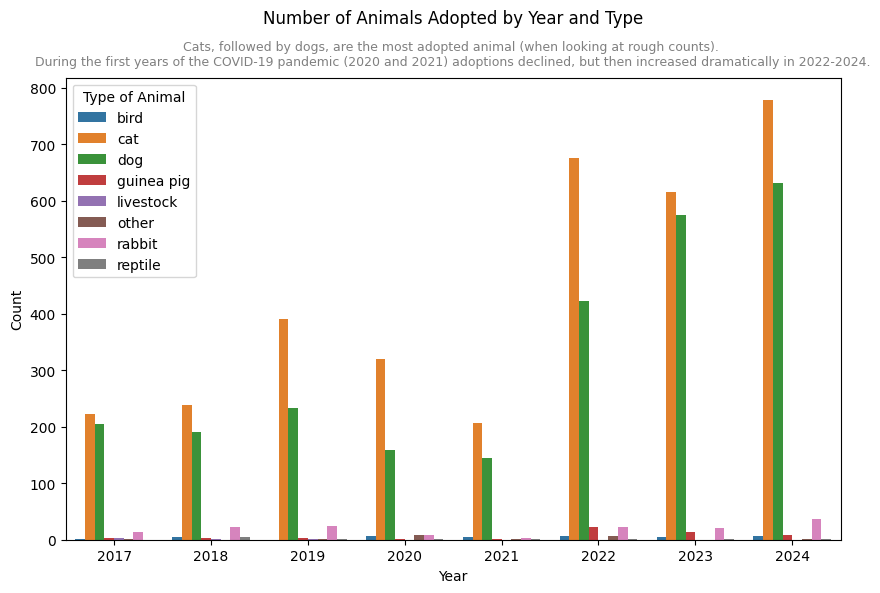

# Pydy Tuesday 2025-03-04

Data Source: [Long Beach Animal
Shelter](https://github.com/rfordatascience/tidytuesday/blob/main/data/2025/2025-03-04/readme.md)

### Data Details

The dataset comes from the [City of Long Beach Animal Care
Services](https://www.longbeach.gov/acs/) via the
[{animalshelter}](https://emilhvitfeldt.github.io/animalshelter/) R
package.

This dataset comprises of the intake and outcome record from Long Beach
Animal Shelter.

### Exploration questions

- How has the number of pet adoptions changed over the years?
- Which type of pets are adopted most often?

## Download data

We can download the data using the `PyDyTuesday` library and specifying
the date. This will load several files: - `longbeach.csv`: data file. -
`meta.yaml`: meta data file with information about the data files and
and the curator. - `lbacs-adoption-graph.png`: Barchart of annual
adoption totals from 2018 to 2022. - `LBACS-logo.png`: Long Beach Animal
Care Services logo.

The data dictionary is located
[here](https://github.com/rfordatascience/tidytuesday/blob/main/data/2025/2025-03-04/readme.md#data-dictionary)

``` python
import PyDyTuesday

# Download files from the week, which you can then read in locally
PyDyTuesday.get_date('2025-03-04')
```

    LBACS-logo.png downloaded
    lbacs-adoption-graph.png downloaded
    longbeach.csv downloaded
    meta.yaml downloaded
    readme.md downloaded

## Explore data

First, let’s read in the data and have a look.

``` python
import pandas as pd

df = pd.read_csv("longbeach.csv")
print(df.head())
```

      animal_id animal_name animal_type primary_color secondary_color      sex  \
    0   A693708   *charlien         dog         white             NaN   Female   
    1   A708149         NaN     reptile         brown           green  Unknown   
    2   A638068         NaN        bird         green             red  Unknown   
    3   A639310         NaN        bird         white            gray  Unknown   
    4   A618968     *morgan         cat         black           white   Female   

              dob intake_date intake_condition intake_type  ... outcome_date  \
    0  2013-02-21  2023-02-20         ill mild       stray  ...   2023-02-26   
    1         NaN  2023-10-03           normal       stray  ...   2023-10-03   
    2         NaN  2020-01-01  injured  severe    wildlife  ...   2020-01-01   
    3         NaN  2020-02-02       ill severe    wildlife  ...   2020-02-02   
    4  2014-12-18  2018-12-18  injured  severe       stray  ...   2019-01-13   

                                              crossing jurisdiction outcome_type  \
    0  [2600 BLK LONG BEACH BLVD, LONG BEACH CA, 90806   Long Beach   euthanasia   
    1                    `600 BLK E HARCOURT, LB 90805   Long Beach       rescue   
    2            0 BLK GRAND AVE, LONG BEACH, CA 90803   Long Beach   euthanasia   
    3           0 BLK TEMPLE AVE, LONG BEACH, CA 90803   Long Beach     transfer   
    4            0 BLK W ZANE ST, LONG BEACH, CA 90805   Long Beach       rescue   

      outcome_subtype   latitude   longitude  outcome_is_dead  was_outcome_alive  \
    0      ill severe  33.804794 -118.188926             True              False   
    1      other resc  33.867999 -118.200931            False               True   
    2      inj severe  33.760478 -118.148091             True              False   
    3            lbah  33.762460 -118.159678            False               True   
    4      littlelion  33.849501 -118.194905            False               True   

                       geopoint  
    0  33.8047935, -118.1889261  
    1  33.8679994, -118.2009307  
    2  33.7604783, -118.1480912  
    3  33.7624598, -118.1596777  
    4  33.8495009, -118.1949053  

    [5 rows x 22 columns]

Now, let’s use the `great_tables` library to print a snapshot of our
data in a prettier format. Because the dataset has 22 columns, we’ll
hide some columns.

``` python
from great_tables import GT

(
    GT(df.head())
    .tab_header(title="Long Beach Animal Shelter", subtitle="Intake and Outcome Records")
    .fmt_date(columns=["dob","intake_date", "outcome_date"], date_style="wd_m_day_year")
    .cols_hide(columns=["animal_name","primary_color", "secondary_color", "intake_subtype", "reason_for_intake", "crossing", "jurisdiction", "latitude", "longitude", "outcome_is_dead", "was_outcome_alive", "geopoint"])
)
```

\<!DOCTYPE html\>
<html lang="en">

<head>

<meta charset="utf-8"/>

</head>

<body>

<div id="vstdadfqun"
style="padding-left:0px;padding-right:0px;padding-top:10px;padding-bottom:10px;overflow-x:auto;overflow-y:auto;width:auto;height:auto;">

<style>
#vstdadfqun table {
          font-family: -apple-system, BlinkMacSystemFont, 'Segoe UI', Roboto, Oxygen, Ubuntu, Cantarell, 'Helvetica Neue', 'Fira Sans', 'Droid Sans', Arial, sans-serif;
          -webkit-font-smoothing: antialiased;
          -moz-osx-font-smoothing: grayscale;
        }
&#10;#vstdadfqun thead, tbody, tfoot, tr, td, th { border-style: none !important; }
 tr { background-color: transparent !important; }
#vstdadfqun p { margin: 0 !important; padding: 0 !important; }
 #vstdadfqun .gt_table { display: table !important; border-collapse: collapse !important; line-height: normal !important; margin-left: auto !important; margin-right: auto !important; color: #333333 !important; font-size: 16px !important; font-weight: normal !important; font-style: normal !important; background-color: #FFFFFF !important; width: auto !important; border-top-style: solid !important; border-top-width: 2px !important; border-top-color: #A8A8A8 !important; border-right-style: none !important; border-right-width: 2px !important; border-right-color: #D3D3D3 !important; border-bottom-style: solid !important; border-bottom-width: 2px !important; border-bottom-color: #A8A8A8 !important; border-left-style: none !important; border-left-width: 2px !important; border-left-color: #D3D3D3 !important; }
 #vstdadfqun .gt_caption { padding-top: 4px !important; padding-bottom: 4px !important; }
 #vstdadfqun .gt_title { color: #333333 !important; font-size: 125% !important; font-weight: initial !important; padding-top: 4px !important; padding-bottom: 4px !important; padding-left: 5px !important; padding-right: 5px !important; border-bottom-color: #FFFFFF !important; border-bottom-width: 0 !important; }
 #vstdadfqun .gt_subtitle { color: #333333 !important; font-size: 85% !important; font-weight: initial !important; padding-top: 3px !important; padding-bottom: 5px !important; padding-left: 5px !important; padding-right: 5px !important; border-top-color: #FFFFFF !important; border-top-width: 0 !important; }
 #vstdadfqun .gt_heading { background-color: #FFFFFF !important; text-align: center !important; border-bottom-color: #FFFFFF !important; border-left-style: none !important; border-left-width: 1px !important; border-left-color: #D3D3D3 !important; border-right-style: none !important; border-right-width: 1px !important; border-right-color: #D3D3D3 !important; }
 #vstdadfqun .gt_bottom_border { border-bottom-style: solid !important; border-bottom-width: 2px !important; border-bottom-color: #D3D3D3 !important; }
 #vstdadfqun .gt_col_headings { border-top-style: solid !important; border-top-width: 2px !important; border-top-color: #D3D3D3 !important; border-bottom-style: solid !important; border-bottom-width: 2px !important; border-bottom-color: #D3D3D3 !important; border-left-style: none !important; border-left-width: 1px !important; border-left-color: #D3D3D3 !important; border-right-style: none !important; border-right-width: 1px !important; border-right-color: #D3D3D3 !important; }
 #vstdadfqun .gt_col_heading { color: #333333 !important; background-color: #FFFFFF !important; font-size: 100% !important; font-weight: normal !important; text-transform: inherit !important; border-left-style: none !important; border-left-width: 1px !important; border-left-color: #D3D3D3 !important; border-right-style: none !important; border-right-width: 1px !important; border-right-color: #D3D3D3 !important; vertical-align: bottom !important; padding-top: 5px !important; padding-bottom: 5px !important; padding-left: 5px !important; padding-right: 5px !important; overflow-x: hidden !important; }
 #vstdadfqun .gt_column_spanner_outer { color: #333333 !important; background-color: #FFFFFF !important; font-size: 100% !important; font-weight: normal !important; text-transform: inherit !important; padding-top: 0 !important; padding-bottom: 0 !important; padding-left: 4px !important; padding-right: 4px !important; }
 #vstdadfqun .gt_column_spanner_outer:first-child { padding-left: 0 !important; }
 #vstdadfqun .gt_column_spanner_outer:last-child { padding-right: 0 !important; }
 #vstdadfqun .gt_column_spanner { border-bottom-style: solid !important; border-bottom-width: 2px !important; border-bottom-color: #D3D3D3 !important; vertical-align: bottom !important; padding-top: 5px !important; padding-bottom: 5px !important; overflow-x: hidden !important; display: inline-block !important; width: 100% !important; }
 #vstdadfqun .gt_spanner_row { border-bottom-style: hidden !important; }
 #vstdadfqun .gt_group_heading { padding-top: 8px !important; padding-bottom: 8px !important; padding-left: 5px !important; padding-right: 5px !important; color: #333333 !important; background-color: #FFFFFF !important; font-size: 100% !important; font-weight: initial !important; text-transform: inherit !important; border-top-style: solid !important; border-top-width: 2px !important; border-top-color: #D3D3D3 !important; border-bottom-style: solid !important; border-bottom-width: 2px !important; border-bottom-color: #D3D3D3 !important; border-left-style: none !important; border-left-width: 1px !important; border-left-color: #D3D3D3 !important; border-right-style: none !important; border-right-width: 1px !important; border-right-color: #D3D3D3 !important; vertical-align: middle !important; text-align: left !important; }
 #vstdadfqun .gt_empty_group_heading { padding: 0.5px !important; color: #333333 !important; background-color: #FFFFFF !important; font-size: 100% !important; font-weight: initial !important; border-top-style: solid !important; border-top-width: 2px !important; border-top-color: #D3D3D3 !important; border-bottom-style: solid !important; border-bottom-width: 2px !important; border-bottom-color: #D3D3D3 !important; vertical-align: middle !important; }
 #vstdadfqun .gt_from_md> :first-child { margin-top: 0 !important; }
 #vstdadfqun .gt_from_md> :last-child { margin-bottom: 0 !important; }
 #vstdadfqun .gt_row { padding-top: 8px !important; padding-bottom: 8px !important; padding-left: 5px !important; padding-right: 5px !important; margin: 10px !important; border-top-style: solid !important; border-top-width: 1px !important; border-top-color: #D3D3D3 !important; border-left-style: none !important; border-left-width: 1px !important; border-left-color: #D3D3D3 !important; border-right-style: none !important; border-right-width: 1px !important; border-right-color: #D3D3D3 !important; vertical-align: middle !important; overflow-x: hidden !important; }
 #vstdadfqun .gt_stub { color: #333333 !important; background-color: #FFFFFF !important; font-size: 100% !important; font-weight: initial !important; text-transform: inherit !important; border-right-style: solid !important; border-right-width: 2px !important; border-right-color: #D3D3D3 !important; padding-left: 5px !important; padding-right: 5px !important; }
 #vstdadfqun .gt_stub_row_group { color: #333333 !important; background-color: #FFFFFF !important; font-size: 100% !important; font-weight: initial !important; text-transform: inherit !important; border-right-style: solid !important; border-right-width: 2px !important; border-right-color: #D3D3D3 !important; padding-left: 5px !important; padding-right: 5px !important; vertical-align: top !important; }
 #vstdadfqun .gt_row_group_first td { border-top-width: 2px !important; }
 #vstdadfqun .gt_row_group_first th { border-top-width: 2px !important; }
 #vstdadfqun .gt_striped { background-color: rgba(128,128,128,0.05) !important; }
 #vstdadfqun .gt_table_body { border-top-style: solid !important; border-top-width: 2px !important; border-top-color: #D3D3D3 !important; border-bottom-style: solid !important; border-bottom-width: 2px !important; border-bottom-color: #D3D3D3 !important; }
 #vstdadfqun .gt_sourcenotes { color: #333333 !important; background-color: #FFFFFF !important; border-bottom-style: none !important; border-bottom-width: 2px !important; border-bottom-color: #D3D3D3 !important; border-left-style: none !important; border-left-width: 2px !important; border-left-color: #D3D3D3 !important; border-right-style: none !important; border-right-width: 2px !important; border-right-color: #D3D3D3 !important; }
 #vstdadfqun .gt_sourcenote { font-size: 90% !important; padding-top: 4px !important; padding-bottom: 4px !important; padding-left: 5px !important; padding-right: 5px !important; text-align: left !important; }
 #vstdadfqun .gt_left { text-align: left !important; }
 #vstdadfqun .gt_center { text-align: center !important; }
 #vstdadfqun .gt_right { text-align: right !important; font-variant-numeric: tabular-nums !important; }
 #vstdadfqun .gt_font_normal { font-weight: normal !important; }
 #vstdadfqun .gt_font_bold { font-weight: bold !important; }
 #vstdadfqun .gt_font_italic { font-style: italic !important; }
 #vstdadfqun .gt_super { font-size: 65% !important; }
 #vstdadfqun .gt_footnote_marks { font-size: 75% !important; vertical-align: 0.4em !important; position: initial !important; }
 #vstdadfqun .gt_asterisk { font-size: 100% !important; vertical-align: 0 !important; }
&#10;</style>

<table class="gt_table" data-quarto-disable-processing="false" data-quarto-bootstrap="false">

<thead>

<tr class="gt_heading">

<td colspan="10" class="gt_heading gt_title gt_font_normal">

Long Beach Animal Shelter
</td>

</tr>

<tr class="gt_heading">

<td colspan="10" class="gt_heading gt_subtitle gt_font_normal gt_bottom_border">

Intake and Outcome Records
</td>

</tr>

<tr class="gt_col_headings">

<th class="gt_col_heading gt_columns_bottom_border gt_left" rowspan="1" colspan="1" scope="col" id="animal_id">

animal_id
</th>

<th class="gt_col_heading gt_columns_bottom_border gt_left" rowspan="1" colspan="1" scope="col" id="animal_type">

animal_type
</th>

<th class="gt_col_heading gt_columns_bottom_border gt_left" rowspan="1" colspan="1" scope="col" id="sex">

sex
</th>

<th class="gt_col_heading gt_columns_bottom_border gt_right" rowspan="1" colspan="1" scope="col" id="dob">

dob
</th>

<th class="gt_col_heading gt_columns_bottom_border gt_right" rowspan="1" colspan="1" scope="col" id="intake_date">

intake_date
</th>

<th class="gt_col_heading gt_columns_bottom_border gt_left" rowspan="1" colspan="1" scope="col" id="intake_condition">

intake_condition
</th>

<th class="gt_col_heading gt_columns_bottom_border gt_left" rowspan="1" colspan="1" scope="col" id="intake_type">

intake_type
</th>

<th class="gt_col_heading gt_columns_bottom_border gt_right" rowspan="1" colspan="1" scope="col" id="outcome_date">

outcome_date
</th>

<th class="gt_col_heading gt_columns_bottom_border gt_left" rowspan="1" colspan="1" scope="col" id="outcome_type">

outcome_type
</th>

<th class="gt_col_heading gt_columns_bottom_border gt_left" rowspan="1" colspan="1" scope="col" id="outcome_subtype">

outcome_subtype
</th>

</tr>

</thead>

<tbody class="gt_table_body">

<tr>

<td class="gt_row gt_left">

A693708
</td>

<td class="gt_row gt_left">

dog
</td>

<td class="gt_row gt_left">

Female
</td>

<td class="gt_row gt_right">

Thu, Feb 21, 2013
</td>

<td class="gt_row gt_right">

Mon, Feb 20, 2023
</td>

<td class="gt_row gt_left">

ill mild
</td>

<td class="gt_row gt_left">

stray
</td>

<td class="gt_row gt_right">

Sun, Feb 26, 2023
</td>

<td class="gt_row gt_left">

euthanasia
</td>

<td class="gt_row gt_left">

ill severe
</td>

</tr>

<tr>

<td class="gt_row gt_left">

A708149
</td>

<td class="gt_row gt_left">

reptile
</td>

<td class="gt_row gt_left">

Unknown
</td>

<td class="gt_row gt_right">

<NA>
</td>

<td class="gt_row gt_right">

Tue, Oct 3, 2023
</td>

<td class="gt_row gt_left">

normal
</td>

<td class="gt_row gt_left">

stray
</td>

<td class="gt_row gt_right">

Tue, Oct 3, 2023
</td>

<td class="gt_row gt_left">

rescue
</td>

<td class="gt_row gt_left">

other resc
</td>

</tr>

<tr>

<td class="gt_row gt_left">

A638068
</td>

<td class="gt_row gt_left">

bird
</td>

<td class="gt_row gt_left">

Unknown
</td>

<td class="gt_row gt_right">

<NA>
</td>

<td class="gt_row gt_right">

Wed, Jan 1, 2020
</td>

<td class="gt_row gt_left">

injured severe
</td>

<td class="gt_row gt_left">

wildlife
</td>

<td class="gt_row gt_right">

Wed, Jan 1, 2020
</td>

<td class="gt_row gt_left">

euthanasia
</td>

<td class="gt_row gt_left">

inj severe
</td>

</tr>

<tr>

<td class="gt_row gt_left">

A639310
</td>

<td class="gt_row gt_left">

bird
</td>

<td class="gt_row gt_left">

Unknown
</td>

<td class="gt_row gt_right">

<NA>
</td>

<td class="gt_row gt_right">

Sun, Feb 2, 2020
</td>

<td class="gt_row gt_left">

ill severe
</td>

<td class="gt_row gt_left">

wildlife
</td>

<td class="gt_row gt_right">

Sun, Feb 2, 2020
</td>

<td class="gt_row gt_left">

transfer
</td>

<td class="gt_row gt_left">

lbah
</td>

</tr>

<tr>

<td class="gt_row gt_left">

A618968
</td>

<td class="gt_row gt_left">

cat
</td>

<td class="gt_row gt_left">

Female
</td>

<td class="gt_row gt_right">

Thu, Dec 18, 2014
</td>

<td class="gt_row gt_right">

Tue, Dec 18, 2018
</td>

<td class="gt_row gt_left">

injured severe
</td>

<td class="gt_row gt_left">

stray
</td>

<td class="gt_row gt_right">

Sun, Jan 13, 2019
</td>

<td class="gt_row gt_left">

rescue
</td>

<td class="gt_row gt_left">

littlelion
</td>

</tr>

</tbody>

</table>

</div>

</body>

</html>

## Pet Adoptions

First, let’s filter our data set to include only
`outcome_type = "adoption"`. We’ll restrict our analysis to only those
animals that whose `outcome_type` is labelled “adoption”, eventhough
some animals labelled “foster to adopt” may have ultimately been
adopted.

Next, we’ll determine the number of animals adopted each year and also
by animal type.

``` python
# filter by outcome_type
adoption_df = df[df['outcome_type'] == 'adoption']

# prep data for plotting as bar plot over time
adoption_df['outcome_date'] = pd.to_datetime(adoption_df['outcome_date']) # make sure outcome_date is formatted correctly
adoption_df['year'] = adoption_df['outcome_date'].dt.year # extract year from outcome_date
grouped_df = adoption_df.groupby(['year', 'animal_type']).size().reset_index(name='count') # Group by year and animal_type, and count occurrences
```

    <positron-console-cell-14>:5: SettingWithCopyWarning: 
    A value is trying to be set on a copy of a slice from a DataFrame.
    Try using .loc[row_indexer,col_indexer] = value instead

    See the caveats in the documentation: https://pandas.pydata.org/pandas-docs/stable/user_guide/indexing.html#returning-a-view-versus-a-copy
    <positron-console-cell-14>:6: SettingWithCopyWarning: 
    A value is trying to be set on a copy of a slice from a DataFrame.
    Try using .loc[row_indexer,col_indexer] = value instead

    See the caveats in the documentation: https://pandas.pydata.org/pandas-docs/stable/user_guide/indexing.html#returning-a-view-versus-a-copy

By plotting the number of adoptions by year and animal type, we see that
cats, followed by dogs, are the most adopted animal (when looking at
rough counts). We also see that during the first years of the COVID-19
pandemic (2020 and 2021) adoptions declined, but then increased
dramatically in 2022-2024.

``` python
import matplotlib.pyplot as plt
import seaborn as sns

# Create a bar plot
plt.figure(figsize=(10, 6))
sns.barplot(data=grouped_df, x='year', y='count', hue='animal_type')

# Customize plot
plt.title('Number of Animals Adopted by Year and Type', y=1.1)
plt.xlabel('Year')
plt.ylabel('Count')
plt.legend(title='Type of Animal')
plt.text(0.5, 1.02, 'Cats, followed by dogs, are the most adopted animal (when looking at rough counts). \nDuring the first years of the COVID-19 pandemic (2020 and 2021) adoptions declined, but then increased dramatically in 2022-2024.', 
         ha='center', va='bottom', transform=plt.gca().transAxes, fontsize=9, color='grey')

# Show the plot
#plt.tight_layout()
plt.show()
```

<figure>

<figcaption aria-hidden="true">png</figcaption>
</figure>
