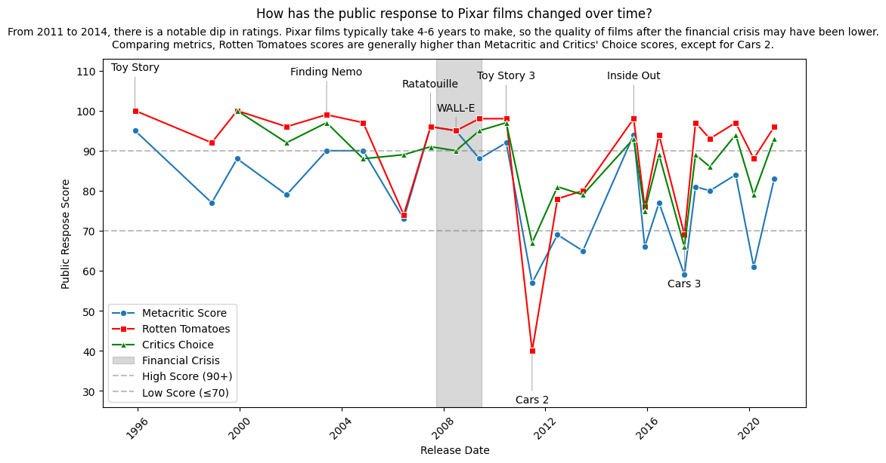

# Pydy Tuesday 2025-03-11


Data Source: [`pixarfilms`](https://erictleung.com/pixarfilms/) R package by [Eric Leung](https://github.com/erictleung).

### Data Details
This package contains six data sets provided mostly by [Wikipedia](https://en.wikipedia.org/wiki/List_of_Pixar_films).

- `pixar_films` - released and upcoming films
- `pixar_people` - main people involved in creating films
- `genres` - movie genres for each film
- `box_office` - box office reception and budget information
- `public_response` - critical and public response
- `academy` - academy awards and nominations

### Exploration questions
- Why are some values missing in the datasets?
- Which films have the highest score in each rating system? 
    - Are there distinct differences in ratings?
- Download the box_office dataset from the {pixarfilms} package. 
    - How does the box_office_us_canada value compare to the various ratings? 
    - Is the trend different for box_office_worldwide?

## Download data
We can download the data using the `PyDyTuesday` library and specifying the date. This will load several files:
- `pixar_films.csv`: data file.
- `public_response.csv`: data file of public responses to Pixar films.
- `pixarfilms_hex.png`: hex sticker for `pixarfilms` package.
- `meta.yaml`: meta data file with information about the data files and the curator.
- `readme.md`: readme file for this week's Tidy Tuesday.

The data dictionary is located [here](https://github.com/rfordatascience/tidytuesday/blob/main/data/2025/2025-03-11/readme.md#data-dictionary)


```python
import PyDyTuesday

# Download files from the week, which you can then read in locally
PyDyTuesday.get_date('2025-03-11')
```

    meta.yaml downloaded
    pixar_films.csv downloaded
    pixarfilms_hex.png downloaded
    public_response.csv downloaded
    readme.md downloaded


## Explore data
First, let's read in the data and have a look. We'll read in two CSV files: `pixar_films.csv` and `public_response.csv`.


```python
import pandas as pd

pf = pd.read_csv("pixar_films.csv")
pr = pd.read_csv("public_response.csv")
```

We'll look at `pixar_films.csv` first. We'll use the `great_tables` library to format the output nicely. The data set contains the name, release date, run time (in minutes), and film rating of all Pixar films.


```python
from great_tables import GT

(
    GT(pf.head())
    .tab_header(title="Pixar Films")
    .fmt_date(columns=["release_date"], date_style="wd_m_day_year")
)
```


<!DOCTYPE html>
<html lang="en">
<head>
<meta charset="utf-8"/>
</head>
<body>
<div id="trjghgwzkd" style="padding-left:0px;padding-right:0px;padding-top:10px;padding-bottom:10px;overflow-x:auto;overflow-y:auto;width:auto;height:auto;">

</style>
<table class="gt_table" data-quarto-disable-processing="false" data-quarto-bootstrap="false">
<thead>

  <tr class="gt_heading">
    <td colspan="5" class="gt_heading gt_title gt_font_normal">Pixar Films</td>
  </tr>
<tr class="gt_col_headings">
  <th class="gt_col_heading gt_columns_bottom_border gt_right" rowspan="1" colspan="1" scope="col" id="number">number</th>
  <th class="gt_col_heading gt_columns_bottom_border gt_left" rowspan="1" colspan="1" scope="col" id="film">film</th>
  <th class="gt_col_heading gt_columns_bottom_border gt_right" rowspan="1" colspan="1" scope="col" id="release_date">release_date</th>
  <th class="gt_col_heading gt_columns_bottom_border gt_right" rowspan="1" colspan="1" scope="col" id="run_time">run_time</th>
  <th class="gt_col_heading gt_columns_bottom_border gt_left" rowspan="1" colspan="1" scope="col" id="film_rating">film_rating</th>
</tr>
</thead>
<tbody class="gt_table_body">
  <tr>
    <td class="gt_row gt_right">1</td>
    <td class="gt_row gt_left">Toy Story</td>
    <td class="gt_row gt_right">Wed, Nov 22, 1995</td>
    <td class="gt_row gt_right">81.0</td>
    <td class="gt_row gt_left">G</td>
  </tr>
  <tr>
    <td class="gt_row gt_right">2</td>
    <td class="gt_row gt_left">A Bug's Life</td>
    <td class="gt_row gt_right">Wed, Nov 25, 1998</td>
    <td class="gt_row gt_right">95.0</td>
    <td class="gt_row gt_left">G</td>
  </tr>
  <tr>
    <td class="gt_row gt_right">3</td>
    <td class="gt_row gt_left">Toy Story 2</td>
    <td class="gt_row gt_right">Wed, Nov 24, 1999</td>
    <td class="gt_row gt_right">92.0</td>
    <td class="gt_row gt_left">G</td>
  </tr>
  <tr>
    <td class="gt_row gt_right">4</td>
    <td class="gt_row gt_left">Monsters, Inc.</td>
    <td class="gt_row gt_right">Fri, Nov 2, 2001</td>
    <td class="gt_row gt_right">92.0</td>
    <td class="gt_row gt_left">G</td>
  </tr>
  <tr>
    <td class="gt_row gt_right">5</td>
    <td class="gt_row gt_left">Finding Nemo</td>
    <td class="gt_row gt_right">Fri, May 30, 2003</td>
    <td class="gt_row gt_right">100.0</td>
    <td class="gt_row gt_left">G</td>
  </tr>
</tbody>


</table>

</div>

</body>
</html>


Next, we'll look at `public_response.csv`, which contains different metrics of public response to each of Pixar's films. Specifically, it contains information on the scores awarded to each film by Rotten Tomatoes, Metacritic, Cinema Score, and Critic's Choice. Note: all scores are numeric out of 100 except the cinema score, which is a grade A+ to F.


```python
(
    GT(pr.head())
    .tab_header(title="Public Response to Pixar Films")
)
```


<!DOCTYPE html>
<html lang="en">
<head>
<meta charset="utf-8"/>
</head>
<body>
<div id="oerfdujjtk" style="padding-left:0px;padding-right:0px;padding-top:10px;padding-bottom:10px;overflow-x:auto;overflow-y:auto;width:auto;height:auto;">

<table class="gt_table" data-quarto-disable-processing="false" data-quarto-bootstrap="false">
<thead>

  <tr class="gt_heading">
    <td colspan="5" class="gt_heading gt_title gt_font_normal">Public Response to Pixar Films</td>
  </tr>
<tr class="gt_col_headings">
  <th class="gt_col_heading gt_columns_bottom_border gt_left" rowspan="1" colspan="1" scope="col" id="film">film</th>
  <th class="gt_col_heading gt_columns_bottom_border gt_right" rowspan="1" colspan="1" scope="col" id="rotten_tomatoes">rotten_tomatoes</th>
  <th class="gt_col_heading gt_columns_bottom_border gt_right" rowspan="1" colspan="1" scope="col" id="metacritic">metacritic</th>
  <th class="gt_col_heading gt_columns_bottom_border gt_left" rowspan="1" colspan="1" scope="col" id="cinema_score">cinema_score</th>
  <th class="gt_col_heading gt_columns_bottom_border gt_right" rowspan="1" colspan="1" scope="col" id="critics_choice">critics_choice</th>
</tr>
</thead>
<tbody class="gt_table_body">
  <tr>
    <td class="gt_row gt_left">Toy Story</td>
    <td class="gt_row gt_right">100.0</td>
    <td class="gt_row gt_right">95.0</td>
    <td class="gt_row gt_left">A</td>
    <td class="gt_row gt_right"><NA></td>
  </tr>
  <tr>
    <td class="gt_row gt_left">A Bug's Life</td>
    <td class="gt_row gt_right">92.0</td>
    <td class="gt_row gt_right">77.0</td>
    <td class="gt_row gt_left">A</td>
    <td class="gt_row gt_right"><NA></td>
  </tr>
  <tr>
    <td class="gt_row gt_left">Toy Story 2</td>
    <td class="gt_row gt_right">100.0</td>
    <td class="gt_row gt_right">88.0</td>
    <td class="gt_row gt_left">A+</td>
    <td class="gt_row gt_right">100.0</td>
  </tr>
  <tr>
    <td class="gt_row gt_left">Monsters, Inc.</td>
    <td class="gt_row gt_right">96.0</td>
    <td class="gt_row gt_right">79.0</td>
    <td class="gt_row gt_left">A+</td>
    <td class="gt_row gt_right">92.0</td>
  </tr>
  <tr>
    <td class="gt_row gt_left">Finding Nemo</td>
    <td class="gt_row gt_right">99.0</td>
    <td class="gt_row gt_right">90.0</td>
    <td class="gt_row gt_left">A+</td>
    <td class="gt_row gt_right">97.0</td>
  </tr>
</tbody>


</table>

</div>

</body>
</html>


# Public Response over time
I'm interested in how critics' scores change over time. It will be useful to merge the two data sets, so I have the information about release date together with public response.


```python
df_merged = pd.merge(pf, pr, on='film', how='left')
print(df_merged.head())
```

       number            film release_date  run_time film_rating  rotten_tomatoes  \
    0       1       Toy Story   1995-11-22      81.0           G            100.0   
    1       2    A Bug's Life   1998-11-25      95.0           G             92.0   
    2       3     Toy Story 2   1999-11-24      92.0           G            100.0   
    3       4  Monsters, Inc.   2001-11-02      92.0           G             96.0   
    4       5    Finding Nemo   2003-05-30     100.0           G             99.0   
    
       metacritic cinema_score  critics_choice  
    0        95.0            A             NaN  
    1        77.0            A             NaN  
    2        88.0           A+           100.0  
    3        79.0           A+            92.0  
    4        90.0           A+            97.0  


```python
import matplotlib.pyplot as plt
import seaborn as sns

df_merged = pd.DataFrame(df_merged)

# Convert release_date to datetime
df_merged["release_date"] = pd.to_datetime(df_merged["release_date"])

# Define score thresholds for annotation
high_threshold = 90
low_threshold = 70

# Plot
plt.figure(figsize=(12, 6))
sns.lineplot(data=df_merged, x="release_date", y="metacritic", marker="o", label="Metacritic Score")
sns.lineplot(data=df_merged, x="release_date", y="rotten_tomatoes", marker="s", label="Rotten Tomatoes", color="red")
sns.lineplot(data=df_merged, x="release_date", y="critics_choice", marker="^", label="Critics Choice", color="green")

ax = plt.gca()

plt.figtext(0.5, 0.90, 
            "From 2011 to 2014, there is a notable dip in ratings. Pixar films typically take 4-6 years to make, "
            "so the quality of films after the financial crisis may have been lower. Comparing metrics, Rotten Tomatoes scores are generally "
            "higher than Metacritic and Critics' Choice scores, except for Cars 2.",
            wrap=True, horizontalalignment='center', fontsize=10, va="bottom")

# add shaded region for the financial crisis
ax.axvspan(pd.to_datetime("2007-09-15"), pd.to_datetime("2009-06-30"), color="gray", alpha=0.3, label="Financial Crisis")

# Annotate very high (>=90) or very low (<=70) scores
offsets = [-15, 15]  # Alternating vertical offset positions
for i, row in enumerate(df_merged.itertuples()):
    # Ensure Critics Choice is not NaN (to avoid errors)
    if pd.isna(row.critics_choice):  # If critics_choice is missing, use only Metacritic & Rotten Tomatoes
        all_high = (row.metacritic >= high_threshold and row.rotten_tomatoes >= high_threshold)
        all_low = (row.metacritic <= low_threshold and row.rotten_tomatoes <= low_threshold)
    else:  # If critics_choice is available, use all three
        all_high = (row.metacritic >= high_threshold and row.rotten_tomatoes >= high_threshold and row.critics_choice >= high_threshold)
        all_low = (row.metacritic <= low_threshold and row.rotten_tomatoes <= low_threshold and row.critics_choice <= low_threshold)

    if all_high or all_low:
        y_offset = 10 if all_high else -13  # Adjust label placement

        # Custom adjustment for a specific annotation (WALL-E)
        if row.film == "WALL-E":  # Modify only this film's annotation
            y_offset = 5  # Lower it slightly by changing the offset

        ax.annotate(
            row.film,
            xy=(row.release_date, row.rotten_tomatoes),
            xytext=(row.release_date, row.rotten_tomatoes + y_offset),
            textcoords="data",
            ha='center', fontsize=10,
            arrowprops=dict(arrowstyle="-", lw=0.5, color='gray')
        )

# Formatting
plt.axhline(high_threshold, color='grey', linestyle='--', alpha=0.5, label=f"High Score ({high_threshold}+)")  
plt.axhline(low_threshold, color='grey', linestyle='--', alpha=0.5, label=f"Low Score (≤{low_threshold})")
plt.ylim(df_merged[['metacritic', 'rotten_tomatoes', 'critics_choice']].min().min() - 14, 
         df_merged[['metacritic', 'rotten_tomatoes', 'critics_choice']].max().max() + 13)
plt.xlabel("Release Date")
plt.ylabel("Public Respose Score")
plt.title("How has the public response to Pixar films changed over time?", y=1.1)
plt.legend()
plt.xticks(rotation=45)
plt.show()
```


    

    


It appears there is a significant dip in ratings between 2011 and 2014. It takes Pixar films about 4-6 years to be made. Therefore, the quality of films released in the 4-6 years following the financial crisis could have been lower. From looking at the rating scores over time, it looks like Rotten Tomatoes is consistently higher than Metacritic and Critic's Choice, with the exception of the score for Cars 2. Below, we'll look at the difference in mean score of each metric.


```python
# Calculate mean and standard deviation for each scoring metric
metrics = ['metacritic', 'rotten_tomatoes', 'critics_choice']

metrics_stats = df_merged[metrics].agg(['mean', 'std'])

print(metrics_stats)
```

          metacritic  rotten_tomatoes  critics_choice
    mean   79.956522        89.173913       87.142857
    std    12.323216        14.153869        9.398328


By determining the mean and standard deviations of scores for each metric, we see that Rotten Tomatoes is, on average, higher than the other scores, but also has the most variability. 
